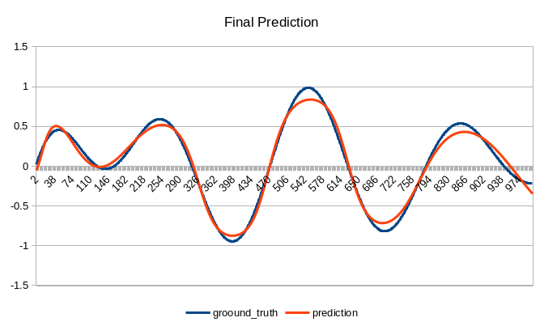
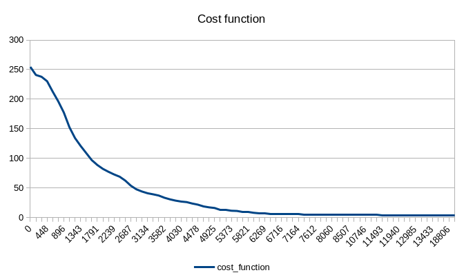
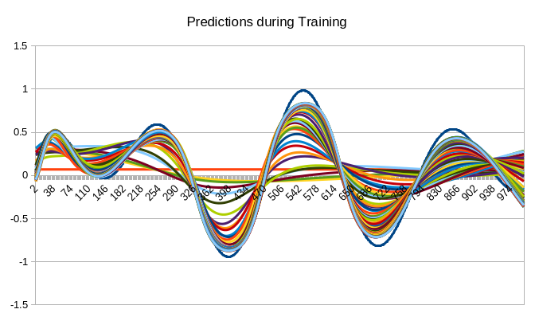

# Genetic Evolution Environment
Project in the making
This project is composed of:
- A genric neuroevolution framework.
- A compatible dense nerual network library that implements fixed structure, direct encoded agents.
- Demos - // TODO

## Demos

Meaningful demos have not been implemented yet.

### Proof of concept

This simple demo is the current [evolution_environment_main.cpp](./EvolutionEnvironment/evolution_environment_main.cpp) main of the main branch, used for testing. In this demo, a dense neural network with [1, 16, 16, 32, 64, 1] nodes per layer, with SiLU activation function in the hidden layers and Tanh in the output layer, with a total of 3027 parameters, is trained to approximate the function $$ y = \sin(x / 50) * \cos(\sqrt(x / 50)) $$ in the range $ x \in [0, 1000] $.

A population of 21 agents, including 3 elites and 4 survivors, was used to train this neural network for 20.000 epochs. This training takes around 9 minutes in an i7-9750h using a single thread.

The final prediction obtained in one execution of this demo is shown below. This was probably an above average run, but the results are very repeatable.

The evolution of the cost function used during the training is shown in the figure below.

And, just for the record, a bunch of predictions during training.

